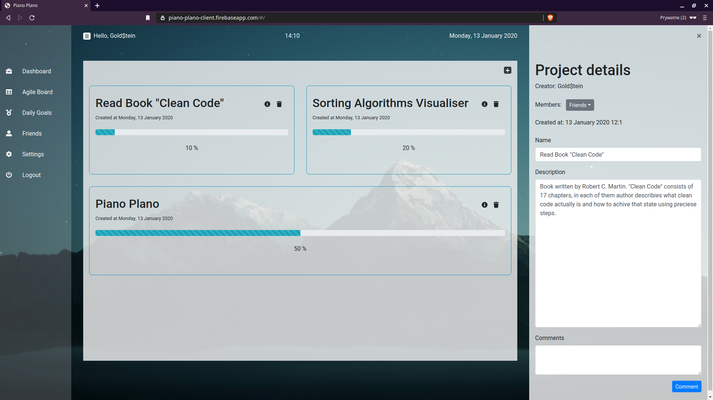
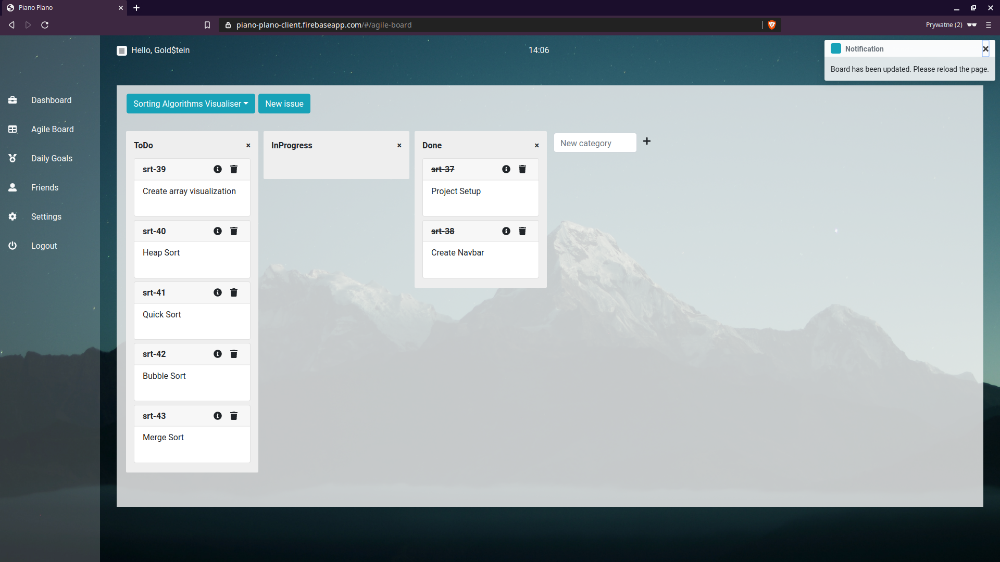
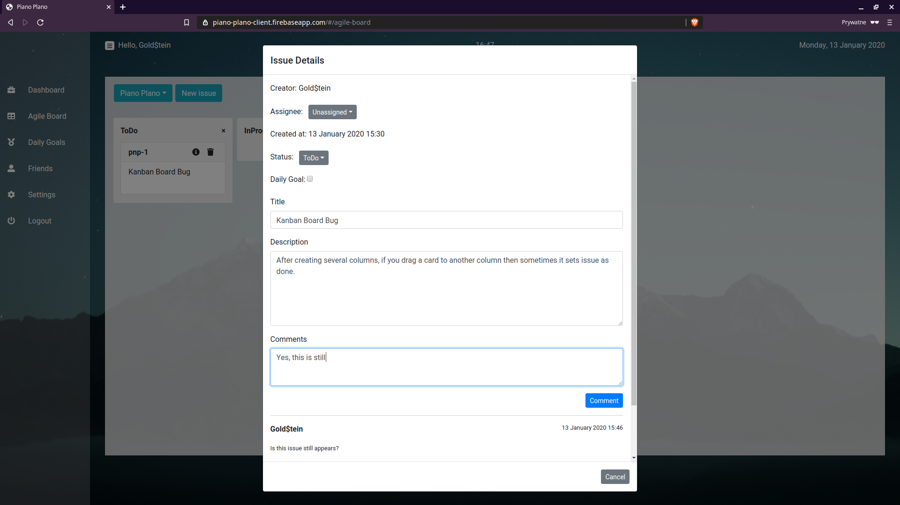
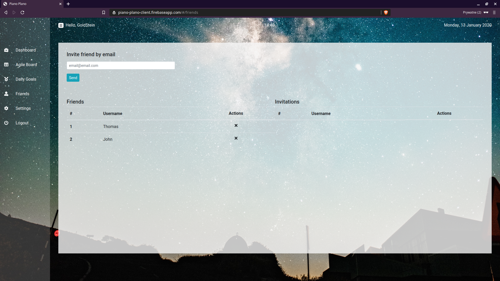
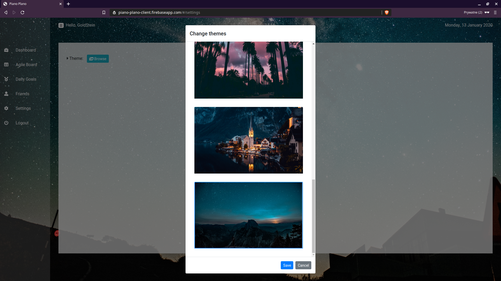
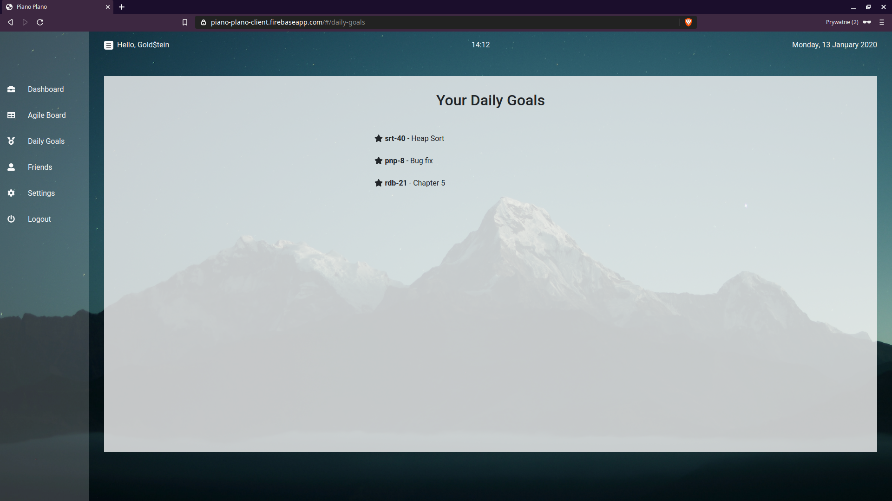

## Links
* [Working demo]()
* [Frontend Repo](https://github.com/ErnestZiemkowski/piano-plano-client)

# Installation
## Using Docker (recommended)
If you want to run whole infrastructure, just type:
```
docker-compose up
```

If you want to run only this container, type:
```
docker run -d 
--name piano-plano
-p 5000:5000 
-e SPRING_DATASOURCE_URL: jdbc:mysql://db/piano-plano-db?          useSSL=false&serverTimezone=UTC&useLegacyDatetimeCode=false
-e SPRING_DATASOURCE_USERNAME: user
-e SPRING_DATASOURCE_PASSWORD: user
ernestziemkowski/piano-plano
 ```

## Oldschool way
Make sure you have already installed Java and Maven. If so, go ahead and follow these instructions:

```
git clone git@github.com:ErnestZiemkowski/piano-plano.git
cd piano-plano
Go to 'application.properties' and set your properties
mvn install
mvn spring-boot:run
```

# Features
* Create Projects and divide its work into atomic issues
* Manage those issues via transparent Kanban Board
* Start discussion over a project or issue
* Assign issues to particular project members
* Set issues as your daily goals
* Invite friends and participate together in your projects 

# Real user experience screenshots






